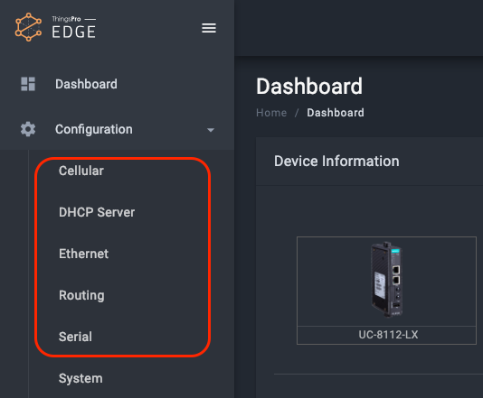

In this document, you learn how to develop a **device type app** that support device configuration and provide system tag.

# Overview

- Device APP is implemented the hardware functions supported on this device.
- Device APP is composed by:
  - Device profile
  - Hardware services
  - Web UI

### Development Steps

1. Complete device profile.
2. Complete Web UI for user to configure this hardware .
3. Complete Hardware service that provide api to : 1. Update information about the hardware interface. 2. Update device database when hardware interface information is updated. Update device database provide user api to :
   _ Get information about this hardware type.
   _ Monitor hardware information on-change. 3. Provide this hardware interface specific direct method. 4. Publish system tag when the key of system tag is turned on.
   

## Device Profile

- Device profile describes the capabilities of this device.
- Format : **yml**
- Schema :
  - **general**:
    | Item | Format | Required | Note |
    | ------------- | -------- | -------- | -------- |
    | modelName | string | ✔ |e.g. UC-8112-LX|
    | deviceType | string | ✔ |enum:[gateway, device] |
    | cpu | string | ✔ |e.g. ARMv7 Cortex-A8 1000 MHz |
    | memorySize | number | ✔ |unit: bytes|
  - **hardwares** **(array)**:
    | Item | Format | Required | Note |
    | ------------- | -------- | -------- | ---- |
    | type | string | ✔ |enum:[ethernet, serial, cellular, gps, wifi]|
    | id | number | ✔ | |
    | displayName | string | ✔ |display name. e.g. PORT 1 |
    | interface | string | ✔ |display name. e.g. eth1 |
    | sysPath | string | ✔ |device path. e.g. /sys/devices/platform/ocp/4a100000.ethernet/net/eth1 |
    | exclusive | boolean | ✔ |device interface supports sharing? |
  - **tags** **(array)**:
    | Item | Format | Required | Note |
    | ------------- | -------- | -------- | ---- |
    | srcName | string | ✔ |source name of tag |
    | tagName | number | ✔ |tag name |
    | dataType | string | ✔ |enum:[uint8, uint16, uint32, uint64, int16, int32, int64, float32, float64, string, boolean, bytearray]|
    | dataUnit | string | |unit of tag |
    | duration | boolean | ✔ |tag polling interval in the unit of millisecond. 0ms means ASAP.|
    | access | string | ✔ |enum:[ro, wo, rw]|
    | default | | |default value of tag|
- [Example](assets/edge/device-profile-uc.yml)

- Installation
  - Put the profile in the app package directory and you can execute the **tdk** to package it.
    

## Hardware Services

- Each hardware in the profile have a **type** attribute, and device app implemented each type of service. The REST APIs that each service must complete is as follows.
- When the developer completes these APIs and updates the database, the user can get information from the device database.
  - Implement device configuration **RESTful** APIs: \* `PATCH` **_/:type/:id_**
    _ description : update information about the items in the list of hardware types that match the id.
    _ `POST` **_/:type/:id_**
    _ description : The method provided by service.
    
    _ Schema : refer to the [api schema page](https://app.swaggerhub.com/apis-docs/moxa-isd/HardwareEnablementAPIs/1.0).
  - Get the infomation from device database :
    - description : The device database is like the shadow of the device . Device app update device database when **device app start** and **service information is updated**.
    - apis : refer to [/resman/hardwares](https://app.swaggerhub.com/apis-docs/dorowu/appman/0.10.0#/Resources/get_resman_hardwares_)
      
    - example:
      ```
      root@Moxa:~# curl https://127.0.0.1/api/v1/resman/hardwares?type=serial \
      -H "mx-api-token:$(cat /var/thingspro/data/mx-api-token)" -k \
      -X GET | json_pp
      [
          {
              "id" : 2,
              "mode" : "rs232",
              "device" : "/dev/ttyM1",
              "type" : "serial",
              "displayName" : "PORT 2"
          },
          {
              "displayName" : "PORT 1",
              "type" : "serial",
              "mode" : "rs232",
              "device" : "/dev/ttyM0",
              "id" : 1
          }
      ]
      ```
  - System tag publish (coming soon)

## Web UI

- Device app has web UI for users to confige interface. The configuration page will appear after installation.
  

- Follow ThingsPro APP development Kit to put Web UI files in the specified folder.
- Put **menu.yml** in the app package directory and you can execute the **tdk** to package it.
- **menu.yml**
  - schema : array
  - items :
    | Item | Format | Required | Note |
    | ------------- | -------- | -------- | ---- |
    | type | string | ✔ |e.g. ethernet|
    | url | string | ✔ |e.g. ui/eth/index.html|
    | priority | number | ✔ |order of shortcut items on the left side of the page|
- Example
  ```
  interfaces:
  - type: ethernet
    url: ui/eth/index.html
    priority: 1
  - type: serial
    url: ui/serial/index.html
    priority: 2
  ```

## ThingsPro UC Device APP

- ISD implement a device app called tp-platform has completed the services as follows. Developers can use or replace it with their own service.
  ```
  interfaces:
  - type: general
    url: ui/general/index.html
    priority: 50
  - type: dhcpd
    url: ui/dhcpd/index.html
    priority: 60
  - type: iptables
    url: ui/iptables/index.html
    priority: 70
  - type: route
    url: ui/route/index.html
    priority: 80
  - type: time
    url: ui/time/index.html
    priority: 90
  ```
- ISD implement a device app called ucdevice has completed the cellular, ethernet, serial and gps services for developers as sample.
- repo : https://github.com/MOXA-ISD/edge-device-mil
