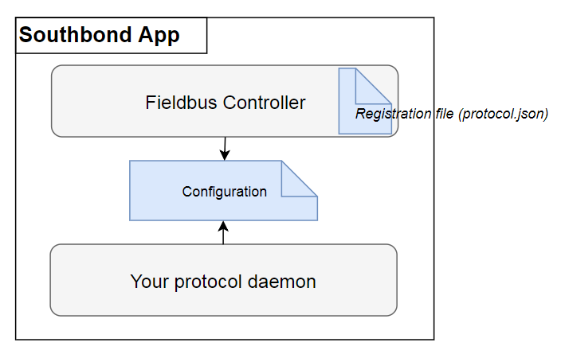
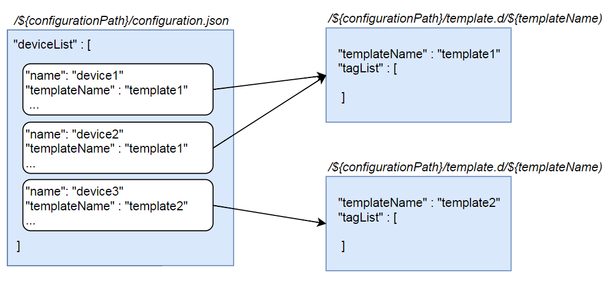

In this quickstart you learn how to develop a data acquisition app(Southbound App) that meets thingspro needs.

## Overview

General Overview of Southbound APP is composed by

- Fieldbus Controller
- Configuration
- Your Protocol Daemon



**_Fieldbus Controller_** is responsible for acting as bridge between app UI and daemon by several communicated interfaces. You have to prepare [registration file](#registration-file-protocoljson) in advanced. Our fieldbus controller will register it to Tag Service App to notify a new protocol App added.

**_Your Protocol Daemon_** is your main application to implement your data acquisition protocol.

**_Configuration_** contains devices and templates configurations of your protocol needed parameters. It includes

- `Devices Configuration`: Devices Configuration contains Devices list and your protocol's Device need parameter.
- `Templates Configuration`: A Template contains Tags list and your protocol's Tag needed parameters. Fieldbus Controller use Template to describe how many Tags under a Device; therefore, Template is a necessary material to create a Device.



### Development Steps

1. Learn how Fieldbus Controller handles protocol Devices and Tags Configuration

   - Define a registration file of app description and protocol's Device and Tag parameter schema, refer to schema format section - [protocol.json](#registration-file-protocoljson)
   - Fieldbus Controller Workflow: refer to [fieldbus controller](#controller-service-fieldbus-controller)

2. After getting configurations, let's implement your protocol daemon:
   1. Polling protocol devices and tags implementation
   2. Publish polling tags, refer to [Tag SDK](edge-appdev-tag)
   3. Implement direct command callbacks for others apps can direct access your tags(read/write), refer to [fieldbus SDK](direct-command-interface-fieldbus-sdk)
      - tag direct read callback handler `**MXFBI_READ_TAG_CALLBACK**`
      - tag direct write callback handler `**MXFBI_WRITE_TAG_CALLBACK**`
      - tags status of devices callback handler `**MXFBI_STATUS_CALLBACK**`
3. Package APP by [Thingspro APP SDK](edge-appdev-app)

## Registration file - protocol.json

- Format : json
- Schema :
  - **_protocol_**
    - `serviceName` your service app name
    - `protocolName` your protocol name
    - `version` your service app version
    - `hostName` your app container host name, should be $(serviceName)\_app_1
  - **_setting_**
    - `startCmds` describe how to start your app
    - `stopCmds` describe how to stop your app
    - `restartCmds` describe how to reload(restart) your app
    - `configurationPath` describe your app configuration path, should be /etc/$(serviceName)/
  - **_schema_**
    - `device` define your protocol's Device needed parameter
    - `tag` define your protocol's Tag needed parameter
      - `name` Key name of Device/Tag Configuration.
      - `attribute` Attribute types dept on your protocol character; `default-required, protocol-required, default-optional`
      - `type` value type of Device/Tag Configuration

Example:

```json
{
  "protocol": {
    "serviceName": "modbusmaster",
    "protocolName": "modbus",
    "version": "0.0.1",
    "hostName": "modbusmaster_app_1"
  },
  "setting": {
    "startCmds": ["/etc/init.d/mxmodbusmaster start"],
    "stopCmds": ["/etc/init.d/mxmodbusmaster stop"],
    "restartCmds": ["/etc/init.d/mxmodbusmaster restart"],
    "configurationPath": "/etc/mxmodbusmaster"
  },
  "schema": {
    "device": [
      { "name": "name", "attribute": "default-required", "type": "string" },
      { "name": "interface", "attribute": "default-required", "type": "string" },
      { "name": "templateName", "attribute": "default-required", "type": "string" }
    ],
    "tag": [
      { "name": "id", "attribute": "default-required", "type": "string" },
      { "name": "op", "attribute": "default-required", "type": "string" },
      { "name": "type", "attribute": "default-required", "type": "string" },
      { "name": "requestTimeoutMs", "attribute": "default-required", "type": "int" },
      { "name": "pollingPeriodMs", "attribute": "default-required", "type": "int" },
      { "name": "description", "attribute": "default-option", "type": "string" }
    ]
  }
}
```

## Controller Service - fieldbus controller

1. Execute Fieldbus Controller as a routine service in your app container

```shell
# arg1: bundle.json folder path, arg2: protocol.json file path
./fbcontroller ./ ./protocol.json
```

2. At the beginning, Controller registers _protocol.json_ to Tag service app to notify a new protocol app is added in the system.
3. Now, Controller starts to receive Tag Service's APIs and handle protocol's Device and Tags Configuration
   - Protocol Devices are configured in `${configurationPath}/configuration.json`
   - Protocol Tags are configured as a template in `${configurationPath}/template.d/$(templateName)`

## Direct command interface - fieldbus SDK

Your protocol app should follow **_fieldbus SDK_** interface, that's other apps are able to direct access filed-side tags(read, write)

```shell
# install fieldbus SDK
$ sudo apt-get install mxfieldbus mxfieldbus-dev
```

### mxfbi_new

```c
mxfbi_t *mxfbi_new ()
```

Create a fieldbus interface instance.

Return value

- fieldbus interface instance.

### mxfbi_read_tag_callback_set

```c
int mxfbi_read_tag_callback_set( mxfbi_t *mxfbi, void *usr_data, MXFBI_READ_TAG_CALLBACK read_tag_callback )
```

Set read tag callback handler

Parameters:

- _mxfbi_t_ mxfbi : mxfbi_t instance\*
- _void_ usr_data : custom user data for the callback function uses.\*
- _MXFBI_READ_TAG_CALLBACK read_tag_callback : read callback function pointer, which your implementation of read tag value by given device and tag name._
- _return value of read callback shall Value struct if successful; otherwise, return NULL._

Return value

- Shall return 0 if successful.

### mxfbi_write_tag_callback_set

```c
int mxfbi_write_tag_callback_set( mxfbi_t *mxfbi, void *usr_data, MXFBI_WRITE_TAG_CALLBACK write_tag_callback )
```

Set write tag callback handler

Parameters:

- _mxfbi_t_ mxfbi : mxfbi_t instance\*
- _void_ usr_data : custom user data for the callback function uses.\*
- _MXFBI_WRITE_TAG_CALLBACK write_tag_callback : write callback function pointer, which your implementation of write tag value by given device and tag name._
  - _return value of write callback shall be 0 if successful; otherwise, return -1._

Return value

- Shall return 0 if successful.

### mxfbi_status_callback_set

```c
int mxfbi_status_callback_set ( mxfbi_t *mxfbi, void *usr_data, MXFBI_STATUS_CALLBACK status_callback )
```

Set device status callback handler

Parameters:

- mxfbi : mxfbi_t instance
- _void_ usr_data : custom user data for the callback function uses.\*
- _MXFBI_STATUS_CALLBACK status_callback : status callback function pointer, which your implementation to report each tags polling status._
  - **_return value of_** **\*status callback have to follow the** [**schema**](#status-callback-return-payload-schema)\*

Return value

- Shall return 0 if successful.

### mxfbi_start

```c
int mxfbi_start( mxfbi_t *mxfbi )
```

Create a thread to start callback message receiving.

Parameters:

- mxfbi : mxfbi_t instance

Return value

- Shall return 0 if successful; otherwise, return -1.

### mxfbi_delete

```c
int mxfbi_delete( mxfbi_t *mxfbi )
```

Delete fieldbus interface instance.

Parameters:

- mxfbi : mxfbi_t instance

Return value

- Shall return 0 if successful.

### Sample Code

```c
#include "mxfbi.h"
Value* read_tag_callback (char *equipment_name, char *tag_name, void *usr_data)
{
   // your protocol read tag implementation
}
int write_tag_callback (char *equipment_name, char *tag_name, uint8_t *write_buffer, int write_size, void *usr_data)
{
    // your protocol write tag implementation
}

char* status_callback (void *obj)
{
   // your protocol device status implementation
}

int main(int argc, char **argv)
{
    mxfbi_userdata      mxfbi_arg;
    mxfbi_t             *mxfbi;
    // init mxfbi.
    mxfbi = mxfbi_new();
    // setup callback functions.
    mxfbi_read_tag_callback_set(mxfbi, (void*)&mxfbi_arg, read_tag_callback);
    mxfbi_write_tag_callback_set(mxfbi, (void*)&mxfbi_arg, write_tag_callback);
    mxfbi_status_callback_set(mxfbi, (void*)&mxfbi_arg, status_callback);
    // main process start monitor signal or recv client msg here.
    mxfbi_start(mxfbi);
    while(!EXIT_SIGINT)
    {
        sleep(1);
    }

    mxfbi_delete(mxfbi);
    return 0;
}
```

### Status callback return payload schema

- Format: json
- Schema :
  - `at` the timestamp of exposing the status callback handler (format: string)
  - `deviceList` all config devices list
    - `name` device name (format: string)
    - `totalTags` total tags of the device's template (format: integer)
    - `successTags` succeeded polling tags of the device's template (format: integer)
    - `tagList` each tag's detail information
      - `name` tag name (format: string)
      - `status` poll tag value success or failure (format: integer)
      - `lastPollingAt` the last time to poll tag (format: string)
      - `lastSuccessAt` the last time of polling tag successfully. (format: string)

Example:

```json
{
  "at": "2018-06-11T08:56:39Z",
  "deviceList": [
    {
      "successTags": 0,
      "totalTags": 2,
      "name": "device4",
      "tagList": [
        {
          "status": 0,
          "lastSuccessAt": "",
          "name": "di0",
          "lastPollingAt": "2018-06-11T08:56:38Z"
        },
        {
          "status": 1,
          "lastSuccessAt": "2018-06-11T08:56:38Z",
          "name": "di1",
          "lastPollingAt": "2018-06-11T08:56:38Z"
        }
      ]
    }
  ]
}
```
