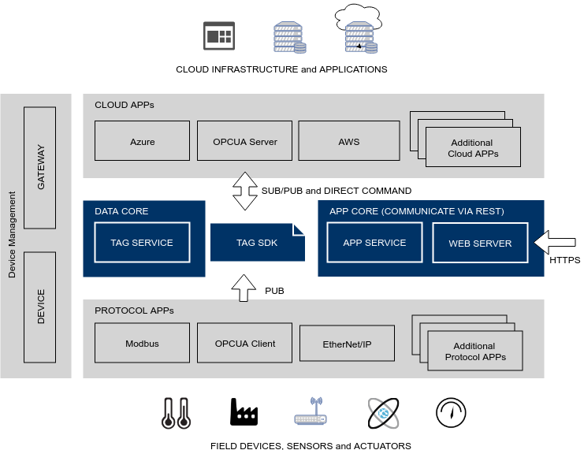

ThingsPro Edge is an intelligent industrial IoT application platform to help you accelerate the make of IIoT edge devices, the development of your IIoT applications, and all the way to build a smarter field site. ThingsPro Edge extends connectivity for data acquisition by APPs.
This document will give you an overview and steps to create an APP running on top of ThingsPro version 3 and after.



- **CLOUD APP** usually to acquires data from field devices, like sensors, smart meters and then publishes the data to subscribers. It also listens to direct command from other APP and routes to the underlying devices.
- **PROTOCOL APP** usually subscribes data from the publisher and then exports to the cloud. It also comprises web interface and backend HTTP service to configure which data to be uploaded and collecting interval. Besides, it comes with a daemon to subscribes data in real time.
- **DATA CORE** is responsible to manage these field devices and tags. APPs will be notified when a device registers to ThingsPro Edge with the protocol the protocol APP provided. The design and implementation will be introduced in [Protocol SDK](edge-appdev-south).
- The web interface of the northbound APP is needed to register to **WEB SERVER** that is a reverse proxy to secure REST API. APP lifecycle is managed by **APP SERVICE**. An APP is container-based and packaged by ThingsPro [developent kit](edge-appdev-app).
- **Device Management** makes the hardware to be managed by ThingsPro Edge and ThingsPro Server.

Following is a typical data acquisition example with this scenario: a MODBUS/TCP master APP to poll data from the field device and then export the data to the cloud:

## STEP 1: Install ThingsPro Edge

### 1.1. Install ThingsPro Edge

A single command is used to install ThingsPro Edge in MOXA hardware, be sure to run it with root privilege

```shell
root@Moxa:~# wget -O- http://repo.moxa.online/static/v3/edge/dists/v0.7.0/install.sh | sh -s $PRODUCT_NAME
...
**********************************************************
* The installation process ended successfully.
**********************************************************
```

Currently supported products are:

- uc8112-lx-cg (UC-8112-LX)
- mc1121 (MC-1121)

You may also find the up-to-date product list by executing:

```shell
root@Moxa:~# wget -O- -q http://repo.moxa.online/static/v3/edge/dists/v0.7.0/install.sh | sh
usage: ./install.sh <product>
products:
  - mc1121
  - uc8112-lx-cg
```

### 1.2. Start ThingsPro Edge

```shell
root@Moxa:~# service thingspro-edge start
```

### 1.3. Wait built-in APPs installed

ThingsPro Edge provides RESTful API for management that is listed in [ThingsPro Edge OAPI server](https://thingspro-edge-oapi.netlify.com/). When first installing ThingsPro Edge, you have to wait a while for installing built-in APPs, such as API service. You can query progress by

```shell
root@Moxa:~# appman app ls
+---------------+----------+--------------------------------+---------+
|     NAME      | VERSION  |     STATE (DESIRED STATE)      | HEALTH  |
+---------------+----------+--------------------------------+---------+
| tagservice    | 0.2.4-14 | installing (ready) - importing | running |
|               |          | images...0% (3/4)              |         |
| thingspro-web | N/A      | init (ready)                   | wait    |
+---------------+----------+--------------------------------+---------+
```

If web service is ready, the state will show `ready`.

NOTE: If the command returns "appman is not ready", that means you have to wait a few seconds until ThingsPro Edge started well.

Now, you can check device profile via API

```shell
root@Moxa:~# curl -s https://127.0.0.1/api/v1/profile \
        -X GET \
        -H "Content-Type:application/json" \
        -H "mx-api-token:$(cat /var/thingspro/data/mx-api-token)" -k | json_pp
{
    "deviceModelName": "UC-8112-LX-CG",
    "deviceType": "iiot-gateway",
    "hardwareInterfaceList": [
        {
            "concurrent": true,
            "devName": "eth0",
            "interfacePath": "/sys/devices/platform/ocp/4a100000.ethernet/net/eth0",
            "name": "ethernet1",
            "type": "ethernet"
        },
        ...
    "moduleList": [
        "docker",
        "message-broker",
        "sanji-framework",
        "thingspro-apps"
    ],
    "systemTagList": [
        {
            "access": "ro",
            "dataType": "string",
            "dataUnit": "",
            "default": "UC-8112-LX",
            "duration": 1000,
            "srcName": "system",
            "tagName": "modelName",
            "tagType": "system"
        },
        ...
    ]
}
```

## STEP 2: Polling Sensor Data Using MODBUS/TCP master APP

ThingsPro Edge has the ability to extend functions by installing APPs. We will start to do data acquisition by installing and MODBUS/TCP master APP.

### 2.1. Install related APP or service

First, update APP index

```shell
root@Moxa:/home/moxa# appman source update
I: updating source stable(https://repo.moxa.online/static/v3/edge/dists/v0.6.0/apps)
I: updated source stable(https://repo.moxa.online/static/v3/edge/dists/v0.6.0/apps)
I: updating package app-azure_0.3.0-17_amd64.mpkg
I: updating package app-azure_0.3.0-17_armhf.mpkg
I: updating package console_0.3.0-5_amd64.mpkg
I: updating package console_0.3.0-5_armhf.mpkg
I: updating package linuxdesktop_0.3.0-10_amd64.mpkg
I: updating package linuxdesktop_0.3.0-10_armhf.mpkg
I: updating package modbusmaster_3.5.6-19_armhf.mpkg
I: updating package nodered_0.3.0-1_armhf.mpkg
I: updating package tagservice_0.2.6-21_amd64.mpkg
I: updating package tagservice_0.2.6-21_armhf.mpkg
I: updating package thingspro-web_0.5.0-14_amd64.mpkg
I: updating package thingspro-web_0.5.0-14_armhf.mpkg
```

Install MODBUS/TCP master APP

```shell
root@Moxa:~# appman app install modbusmaster
```

### 2.2. Add MODBUS slave devices and define tags to read

Before creating a device, we must add a template that defines data elements(tags). The template can be download at [here](assets/edge/iologik-e2242.json)

```shell
root@Moxa:~# curl https://127.0.0.1/api/v1/tags/fieldbus/modbus/templates/iologik-e2242 \
        -X POST \
        -H "Content-Type:application/json" \
        -H "mx-api-token:$(cat /var/thingspro/data/mx-api-token)" -k \
        -d @./iologik-e2242.json | json_pp
{
"templateName" : "iologik-e2242.json",
   "tagList" : [
      {
         "type" : "uint16",
         "pollingPeriodMs" : 1000,
         "address" : 0,
         "id" : "di0",
         "op" : "read",
         "quantity" : 1,
         "function" : "read-coils",
         "requestTimeoutMs" : 5000
      },
      ...
      {
         "pollingPeriodMs" : 1000,
         "type" : "uint16",
         "id" : "di3",
         "address" : 3,
         "function" : "read-coils",
         "quantity" : 1,
         "op" : "read",
         "requestTimeoutMs" : 5000
      }
   ]
}
```

Wait modbusmaster and tagservice are ready as following

```shell
+---------------+---------------------+---------------------------+--------+
|     NAME      |       VERSION       |   STATE (DESIRED STATE)   | HEALTH |
+---------------+---------------------+---------------------------+--------+
| app-azure     | N/A (0.3.0-15)      | uninstalled (uninstalled) | good   |
| console       | N/A (0.3.0-5)       | uninstalled (uninstalled) | good   |
| linuxdesktop  | N/A (0.3.0-10)      | uninstalled (uninstalled) | good   |
| modbusmaster  | 3.5.3-11 (3.5.3-11) | ready (ready)             | good   |
| tagservice    | 0.2.4-14 (0.2.4-14) | ready (ready)             | good   |
| thingspro-web | 0.3.0-1 (0.3.0-1)   | ready (ready)             | good   |
+---------------+---------------------+---------------------------+--------+
```

Add a device associating to the template, where `10.144.33.168` must be replaced to the IP address of your computer that simulates a Modbus device and `eth3` is the interface to the simulator.

```shell
root@Moxa:~# curl https://127.0.0.1/api/v1/tags/fieldbus/modbus/device \
        -X POST \
        -H "Content-Type:application/json" \
        -H "mx-api-token:$(cat /var/thingspro/data/mx-api-token)" -k \
        -d '{"name":"My_ioLogik-E2242","interface":"eth3","templateName":"iologik-e2242.json","host":"10.144.33.168","deviceId":0,"service":502}' | json_pp
{
   "service" : 502,
   "protocol" : "modbus",
   "host" : "10.144.32.107",
   "name" : "My_ioLogik-E2242",
   "id" : "05c3aa3a0ed445449586fa19e4d044e1",
   "interface" : "eth0",
   "hostName" : "modbusmaster_app_1",
   "templateName" : "iologik-e2242.json",
   "deviceId" : 0
}
```

Check device list

```shell
root@Moxa:~# curl https://127.0.0.1/api/v1/tags/fieldbus/modbus/devices \
        -X GET \
        -H "Content-Type:application/json" \
        -H "mx-api-token:$(cat /var/thingspro/data/mx-api-token)" -k | json_pp
{
   "deviceList" : [
      {
         "id" : "5c09fae3e83845fb8459159389079deb",
         "protocol" : "modbus",
         "host" : "10.144.32.107",
         "name" : "My_ioLogik-E2242",
         "templateName" : "iologik-e2242.json",
         "deviceId" : 0,
         "interface" : "eth3",
         "hostName" : "modbusmaster_app_1",
         "service" : 502
      }
   ]
}
```

Then, you may install a Modbus simulator. For example, we use [modrssim](https://sourceforge.net/projects/modrssim/). Open it and set protocol to TCP.


The number of `received/sent` should increase if connected.

### Tag Types

In the previous section, we add a device and define its data element that called **I/O Tag** in ThingsPro Edge. I/O Tag can be listed by API

```shell
root@Moxa:~# curl https://127.0.0.1/api/v1/tags/fieldbus \
        -X GET \
        -H "Content-Type:application/json" \
        -H "mx-api-token:$(cat /var/thingspro/data/mx-api-token)" -k
```

If you want to retrieve CPU usage, memory usage and others metrics of the system that named **System Tag**. The supported system tag can be fetched by

```shell
root@Moxa:~# curl https://127.0.0.1/api/v1/tags/system \
        -X GET \
        -H "Content-Type:application/json" \
        -H "mx-api-token:$(cat /var/thingspro/data/mx-api-token)" -k
```

The last tag is **Virtual Tag**. It is used by APP (normally a northbound APP) publishing virtual data which used by another APP after it streamlines real data from devices. The supported virtual tags list by the following API

```shell
root@Moxa:~# curl https://127.0.0.1/api/v1/tags/virtual \
        -X GET \
        -H "Content-Type:application/json" \
        -H "mx-api-token:$(cat /var/thingspro/data/mx-api-token)" -k
```

## STEP 3: Create Hello APP to read and display the tag data

To subscribe data, we used a simple Hello APP wirtten in Python code to show the data

```python
from libmxidaf_py import TagV2

def on_tag_callback(equipment_name, tag_name, tag):
    print("{}:{}:{}:{}:{}".format(
        equipment_name,
        tag_name,
        tag.at(),
        tag.value(),
        tag.unit()
    ))

tagv2 = TagV2.instance()
tagv2.subscribe_callback(on_tag_callback)
tagv2.subscribe(
    "My_ioLogik-E2242",
    "di0"
)
```

This sample is already packed as an APP. You can install it by

```shell
root@Moxa:~# appman app install hello-north
```

Then open [https://<board-ip>/apps/hello-north/](https://<board-ip>/apps/hello-north/) to see the data which looks like


You can get source easily by `tdk`. Please refer to [Development Kit](edge-appdev-app).
