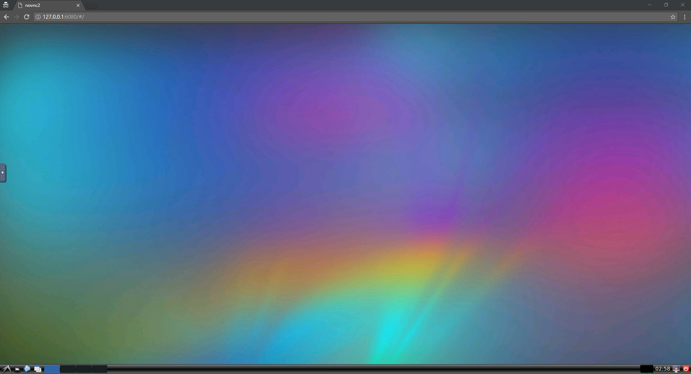
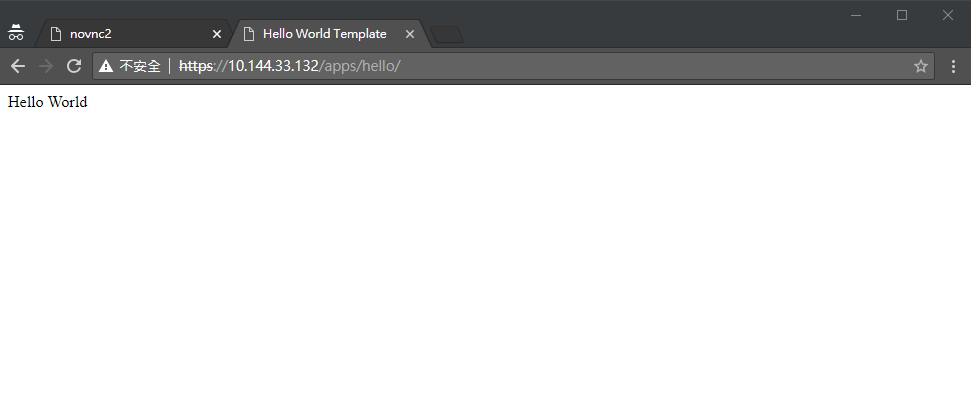

TDK is a development toolkit used to create application and pack it for MOXA ThingsPro Edge. The Application package is called MPKG (MOXA package), which is extended Docker and Docker Compose. Software that published by Docker now is easily to publish to ThingsPro Edge too. In this document, we will introduce develop and verify a simple hello application for ThinsgPro Edge via TDK.

## Prerequisite

- Windows/OSX/Linux computer with [Docker ≥ 18.03](https://docs.docker.com/install/)
- MOXA UC-8100 series with ThingsPro v3 preinstalled

## Prepare Development Environment

Start ThingsPro Development Desktop

    $ docker run --name tdd -p 6080:80 -p 8000:8000 -v /:/host moxaisd/thingspro-dev-desktop:linux-amd64

You can browse [http://127.0.0.1:6080](http://127.0.0.1:6080) to use TDK

## Create Hello World App

In TDD, open a LXTerminal by the menu in the left-bottom corner, then create a Hello World sample.

    $ mkdir hello
    $ cd hello
    $ tdk init --template=hello --lang=python3 --arch=armhf

where the parameters of `tdk init` means that creating a project with project name **hello** using **python3** on **ARM** platform.

You also can find all templates by following command

    $ tdk init --list
    +----------+----------+--------------+
    | TEMPLATE | LANGUAGE | ARCHITECTURE |
    +----------+----------+--------------+
    | hello    | golang   | armhf        |
    | hello    | python3  | amd64        |
    | hello    | python3  | armhf        |
    +----------+----------+--------------+

After initializing successfully, the file structure looks like

    ├── docker-compose.yml
    ├── Dockerfile
    ├── metadata.yml
    ├── nginx.conf
    └── src
        ├── app.py
        ├── requirements.txt
        └── templates
            └── index.html

`[Dockerfile](https://docs.docker.com/compose/compose-file/)` describe how the docker image is built, and `[docker-compose.yml](https://docs.docker.com/compose/compose-file/)` defines running multi-container Docker application. `metadata.yml` defines how it works and shows in App Market of ThingsPro Edge. ThingsPro Edge has a web server in front of all apps. App has to define which pages and any RESTful APIs expose to exterior in `[nginx.conf](https://nginx.org/en/docs/)`. `src` is implementation of this App.

## Build

Build the program as a Docker image

    $ docker build -t user/hello:0.1.0 .
    Sending build context to Docker daemon  10.75kB
    Step 1/13 : FROM debian:stretch-slim as qemu
    [skip]
     ---> Using cache
     ---> 16cb1f27639b
    Successfully built 16cb1f27639b
    Successfully tagged user/hello:0.1.0

Pack

    $ tdk pack
    INFO[0000] [Parse docker-compose.yml]
    INFO[0000] [Save images]
    INFO[0000] user/hello:0.1.0
    INFO[0006] [Save files]
    INFO[0006] Copy docker-compose.yml
    INFO[0006] Copy metadata.yml
    INFO[0006] Copy image.txz
    INFO[0007] Copy nginx.conf
    INFO[0007] [pack]
    INFO[0007] Success!
    INFO[0007] hello_0.1.0_armhf.mpkg 23.59 MB

## Deploy

Start a http server to provide applications

    $ python3 -m http.server

SSH to the board, then install application by following command (replace **<board-ip>** according to your environment)

    root@Moxa:/home/moxa# appman app install http://<dev-env-ip>:8000/hello_0.1.0_armhf.mpkg
    {
      "arch": "armhf",
      "attributes": null,
      "description": "An simple example",
      "desiredState": "ready",
      "displayName": "hello world",
      "hardware": null,
      "health": "wait",
      "icon": "",
      "name": "hello",
      "state": "init",
      "version": "0.1.0"
    }

Check install progress

    root@Moxa:/home/moxa# appman app ls name=hello fields=runtime
    {
      "desiredState": "ready",
      "health": "running",
      "progress": {
        "currentTask": 3,
        "message": "",
        "percentage": 0,
        "totalTask": 3
      },
      "state": "installing"
    }

After state is ready, browse your application at https://<board_ip>/apps/hello/

Congrats! You are successful to complete your first ThingsPro App.

## Next

1. Develop a south app
2. Develop a north app

## Troubleshooting

**How do I check installation procedure in detail?**

Check the log of App Manager by

    $ sudo docker logs -f --tail=100 core-appman

**Where is my App stored?**

Your App will be stored at App path where is `/var/thingspro/apps/<appname>`. nginx.conf will be located `/var/thingspro/nginx-conf/<appname>.conf`. UI folder will be extracted to `/var/thingspro/www/apps/<appname>`

**My App is installed, but I connect with browser, it shows 4xx/5xx error code**

This means something wrong in App's nginx.conf or App's HTTP service. First of all, check HTTP service. You may find container IP by `docker inspect <container-name>`. Then, use `curl http://<container-ip>/...` to check HTTP service is connective from the host. If yes, check `nginx.conf`. App nginx.conf is located in `/var/thingspro/nginx-conf/<appname>.conf`. Revise it, reload it by `docker exec core-web nginx -s reload``, and finally test it.

**Can I start my app manually with docker-compose command?**

We support docker-compose.yml v2 and v3. v2 will operate by library, so you can not start or stop by any command. If you are using v3 and App name is `hello`, you can manage by docker-compose command, like this

    $ docker exec -it core-appman bash
    $ cd /var/thingspro/apps/hello
    $ docker-compose -f .docker-compose.yml start

## App Management

append `--help` after command to get explanation in detail

    root@Moxa:~# appman
    App Manager of MOXA

    Usage:
      appman [command]

    Available Commands:
      app         app management
      daemon      Run daemon
      deinit      deinitialize containers
      help        Help about any command
      init        init containers
      version     Print the version number

    Flags:
      -h, --help      help for appman
          --verbose   verbose output
          --version   version for appman

    Use "appman [command] --help" for more information about a command.

Install an App

    # appman app install https://...
    or
    # appman app install /home/moxa/...

List Apps

    # appman app ls

Start an App

    # appman app start <appname>

Stop an App

    # appman app stop <appname>
