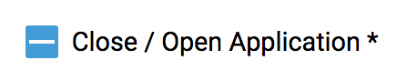

## Description

The component configuration provides a convenient way to create **a UI with dynamically form fields**. For instance, if you want to have a form that let users to change some value of applications, you can simply write **a json file with following field types**.

### Notice

The json file is `app.resource.json` at path `app-ui-starter/apps/app/src/assets/`. We recommend you to change some fields in `app.resource.json` following the field roles below and you will quickly know how to use it :)

## How to use

### 1. The format of `app.resource.json`

- name: A unique application name
- displayName: The application name shown on the UI
- path: It will send a get or update request to this path
- fields: A group of form fields that have different field validations.

```json
{
  "name": "azure",
  "displayName": "Azure Application",
  "path": "/apps/azure",
  "fields": [
    {
      "key": "connection_string",
      "type": "input",
      "templateOptions": {
        "placeholder": "Device Connection String"
      }
    },
    {
      "key": "transport_protocol",
      "type": "select",
      "templateOptions": {
        "label": "Transport Protocol",
        "placeholder": "Transport Protocol",
        "options": [
          {
            "value": "MQTT",
            "label": "MQTT"
          },
          {
            "value": "AMQP",
            "label": "AMQP"
          },
          {
            "value": "HTTP",
            "label": "HTTP"
          }
        ]
      }
    },
    {
      "key": "tags",
      "type": "tagSelector"
    },
    {
      "key": "event",
      "type": "float",
      "templateOptions": {
        "label": "Event Update Interval"
      }
    }
  ]
}
```

### 2. Change the name / displayName / path

Change name, displayName, and path based on your applications.

#### Notice

You CANNOT load and update data if you set up an improper path.

```json
{
  "name": "azure",
  "displayName": "Azure Application",
  "path": "/apps/azure"
}
```

### 3. Change the form fields following each field roles

It is VERY important to write a RIGHT form fields with RIGHT field roles.

#### Example

```json
{
  "fields": [
    {
      "key": "connection_string",
      "type": "input",
      "templateOptions": {
        "placeholder": "Device Connection String"
      }
    }
  ]
}
```

- `fields` : The property is **REQUIRE** to let the system know this is a form field group.
- `key` : The key **MUST BE THE SAME** as the data loaded from your path.

  For example:
  The data loaded from your path is

  ```json
  {
    "name": "example",
    "status": true
  }
  ```

  The key will be

  ```json
  {
    "fields": [
      {
        "key": "name",
        "type": "input",
        "templateOptions": {
          "placeholder": "A description of name"
        }
      },
      {
        "key": "status",
        "type": "input",
        "templateOptions": {
          "placeholder": "A description of status"
        }
      }
    ]
  }
  ```

- `type` : The type of form filed.
- `templateOptions` : The role of each form fields.

## The type and role of form fields

### Help: Usage

Each form field have a unique name with a role property table. For instance, the `checkbox` is type and the table below is its role.
To create a checkbox, write:

```json
{
  "key": "status",
  "type": "checkbox",
  "templateOptions": {
    "label": "Close / Open Application",
    "required": true,
    "align": "start"
  }
}
```

The result will be:


### Notice: Regex

The **`Regex`** is a Regular Expression Validator to help system validate user input. It user input does not match the description of `Regex`, they cannot submit the form.

### `checkbox`

| Property | type    | Description      |
| -------- | ------- | ---------------- |
| label    | string  |                  |
| required | boolean |                  |
| align    | string  | `start` or `end` |

#### Example

```json
{
  "key": "status",
  "type": "checkbox",
  "templateOptions": {
    "label": "Close / Open Application",
    "required": true,
    "align": "start"
  }
}
```

### `datetimepicker`

| Property    | type   | Description |
| ----------- | ------ | ----------- |
| placeholder | string |             |

#### Example

```json
{
  "key": "datetimepicker",
  "type": "datetimepicker",
  "templateOptions": {
    "placeholder": "Select Time"
  }
}
```

### `aliasName`

#### Regex:

```javascript
/^[A-Za-z0-9_-]{3,255}$/;
```

| Property    | type   | Description |
| ----------- | ------ | ----------- |
| label       | string |             |
| placeholder | string |             |

#### Example

```json
{
  "key": "aliasName",
  "type": "aliasName",
  "templateOptions": {
    "label": "Alias Name"
  }
}
```

### `domain`

#### Regex:

```javascript
/^(([a-zA-Z0-9]|[a-zA-Z0-9][a-zA-Z0-9-]*[a-zA-Z0-9])\.)*([A-Za-z0-9]|[A-Za-z0-9][A-Za-z0-9-]*[A-Za-z0-9])$/;
```

| Property    | type   | Description |
| ----------- | ------ | ----------- |
| label       | string |             |
| placeholder | string | 127.0.0.1   |

#### Example

```json
{
  "key": "domain",
  "type": "domain",
  "templateOptions": {
    "label": "Domain",
    "placeholder": "127.0.0.1"
  }
}
```

### `email`

#### Regex:

```javascript
/[a-z0-9!#$%&'*+/=?^_`{|}~-]+(?:\.[a-z0-9!#$%&'*+/=?^_`{|}~-]+)*@(?:[a-z0-9](?:[a-z0-9-]*[a-z0-9])?\.)+[a-z0-9](?:[a-z0-9-]*[a-z0-9])?/;
```

| Property    | type   | Description |
| ----------- | ------ | ----------- |
| label       | string |             |
| placeholder | string |             |

#### Example

```json
{
  "key": "email",
  "type": "email",
  "templateOptions": {
    "label": "Email",
    "placeholder": "example@gmail.com"
  }
}
```

### `file`

- Usage: A special form field used to `select a file and upload it to target path`

No templateOptions.

#### Example

```json
{
  "key": "file",
  "type": "file"
}
```

### `float`

| Property    | type   | Description                    |
| ----------- | ------ | ------------------------------ |
| label       | string |                                |
| placeholder | string |                                |
| min         | float  | default min number is `-65535` |
| max         | float  | default max number is `65535`  |

#### Example

```json
{
  "key": "float",
  "type": "float",
  "templateOptions": {
    "label": "Label",
    "placeholder": "3.14",
    "min": 0,
    "max": 100
  }
}
```

### `hostname`

Its behaviour is the same as `domain` but with **different error message with `hostname` word**.

### `input`

Usage: lets users type data without any restriction.

| Property    | type   | Description |
| ----------- | ------ | ----------- |
| placeholder | string |             |

### `ip`

#### Regex:

```javascript
// Check ip format
/^(([0-9]|[1-9][0-9]|1[0-9]{2}|2[0-4][0-9]|25[0-5])\.){3}([0-9]|[1-9][0-9]|1[0-9]{2}|2[0-4][0-9]|25[0-5])$/
or
// Check multicast IP, e.g. 224.0.0.1, 239.255.255.255
/2(?:2[4-9]|3\d)(?:\.(?:25[0-5]|2[0-4]\d|1\d\d|[1-9]\d?|0)){3}/
```

| Property    | type   | Description  |
| ----------- | ------ | ------------ |
| label       | string | default `IP` |
| placeholder | string |              |

#### Example

```json
{
  "key": "ip",
  "type": "ip",
  "templateOptions": {
    "label": "IP",
    "placeholder": "127.0.0.1"
  }
}
```

### `latitude`

#### Regex:

```javascript
/^[-+]?([1-8]?\d(\.\d+)?|90(\.0+)?)$/;
```

| Property    | type   | Description        |
| ----------- | ------ | ------------------ |
| label       | string | default `Latitude` |
| placeholder | string |                    |

### `longitude`

#### Regex:

```javascript
/^[-+]?(180(\.0+)?|((1[0-7]\d)|([1-9]?\d))(\.\d+)?)$/;
```

| Property    | type   | Description         |
| ----------- | ------ | ------------------- |
| label       | string | default `Longitude` |
| placeholder | string |                     |

### `mac`

#### Regex:

```javascript
/^([0-9A-F]{2}[:]){5}([0-9A-F]{2})$/;
```

| Property    | type   | Description   |
| ----------- | ------ | ------------- |
| label       | string | default `MAC` |
| placeholder | string |               |

### `number`

#### Regex:

```javascript
/^d+$/;
```

| Property    | type    | Description      |
| ----------- | ------- | ---------------- |
| label       | string  | default `Number` |
| placeholder | string  |                  |
| min         | integer | default `-65535` |
| max         | integer | default `65535`  |

#### Example

```json
{
  "key": "number",
  "type": "number",
  "templateOptions": {
    "label": "Label",
    "placeholder": "3",
    "min": 0,
    "max": 100
  }
}
```

### `password`

| Property    | type   | Description        |
| ----------- | ------ | ------------------ |
| label       | string | default `Password` |
| placeholder | string |                    |

#### Example

```json
{
  "key": "password",
  "type": "password",
  "templateOptions": {
    "label": "Password Label",
    "placeholder": "Your password"
  }
}
```

### `port`

| Property    | type    | Description     |
| ----------- | ------- | --------------- |
| label       | string  | default `Port`  |
| placeholder | string  |                 |
| min         | integer | default `1`     |
| max         | integer | default `65535` |

#### Example

```json
{
  "key": "port",
  "type": "port",
  "templateOptions": {
    "label": "Label",
    "placeholder": "Placeholder",
    "min": 1,
    "max": 20
  }
}
```

### `textarea`

| Property    | type   | Description        |
| ----------- | ------ | ------------------ |
| label       | string | default `Textarea` |
| placeholder | string |                    |

#### Example

```json
{
  "key": "textarea",
  "type": "textarea",
  "templateOptions": {
    "label": "Label",
    "placeholder": "Placeholder"
  }
}
```

### `url`

#### Regex:

```javascript
/(https?:\/\/(?:www\.|(?!www))[a-zA-Z0-9][a-zA-Z0-9-]+[a-zA-Z0-9]\.[^\s]{2,}|www\.[a-zA-Z0-9][a-zA-Z0-9-]+[a-zA-Z0-9]\.[^\s]{2,}|https?:\/\/(?:www\.|(?!www))[a-zA-Z0-9]\.[^\s]{2,}|www\.[a-zA-Z0-9]\.[^\s]{2,})/;
```

| Property    | type   | Description   |
| ----------- | ------ | ------------- |
| label       | string | default `Url` |
| placeholder | string |               |

#### Example

```json
{
  "key": "url",
  "type": "url",
  "templateOptions": {
    "label": "Label",
    "placeholder": "Placeholder"
  }
}
```

### `radio`

| Property | type                                                 | Description     |
| -------- | ---------------------------------------------------- | --------------- |
| label    | string                                               | default `Radio` |
| options  | \[{ "key": string, "label": string, "value": any }\] |                 |

#### Example

```json
{
  "key": "radio",
  "type": "radio",
  "templateOptions": {
    "options": [
      {
        "value": 1,
        "label": "Option 1"
      },
      {
        "value": 2,
        "label": "Option 2"
      },
      {
        "value": 3,
        "label": "Option 3"
      },
      {
        "value": 4,
        "label": "Option 4"
      }
    ]
  }
}
```

### `select`

| Property | type                                                   | Description      |
| -------- | ------------------------------------------------------ | ---------------- |
| label    | string                                                 | default `Select` |
| options  | { "disabled": boolean, "label": string, "value": any } |                  |

#### Example

```json
{
  "key": "Select",
  "type": "select",
  "templateOptions": {
    "label": "Select",
    "placeholder": "Placeholder",
    "description": "Description",
    "required": true,
    "options": [
      {
        "value": 1,
        "label": "Option 1"
      },
      {
        "value": 2,
        "label": "Option 2"
      },
      {
        "value": 3,
        "label": "Option 3"
      },
      {
        "value": 4,
        "label": "Option 4"
      }
    ]
  }
}
```

### `slider`

| Property | type    | Description                              |
| -------- | ------- | ---------------------------------------- |
| label    | string  | default Slider                           |
| min      | integer |                                          |
| max      | integer |                                          |
| step     | integer | The values at which the thumb will snap. |

#### Example

```json
{
  "key": "slider",
  "type": "slider",
  "templateOptions": {
    "min": 0,
    "max": 100,
    "step": 10
  }
}
```

### `tagSelector`

### Notice

The type is for cloud applications to select required tags.

#### Example

```json
{
  "key": "tagSelector",
  "type": "tagSelector"
}
```

### `toggle`

| Property | type   | Description    |
| -------- | ------ | -------------- |
| label    | string | default Toggle |

#### Example

```json
{
  "key": "toggle",
  "type": "toggle",
  "templateOptions": {
    "label": "Label"
  }
}
```
